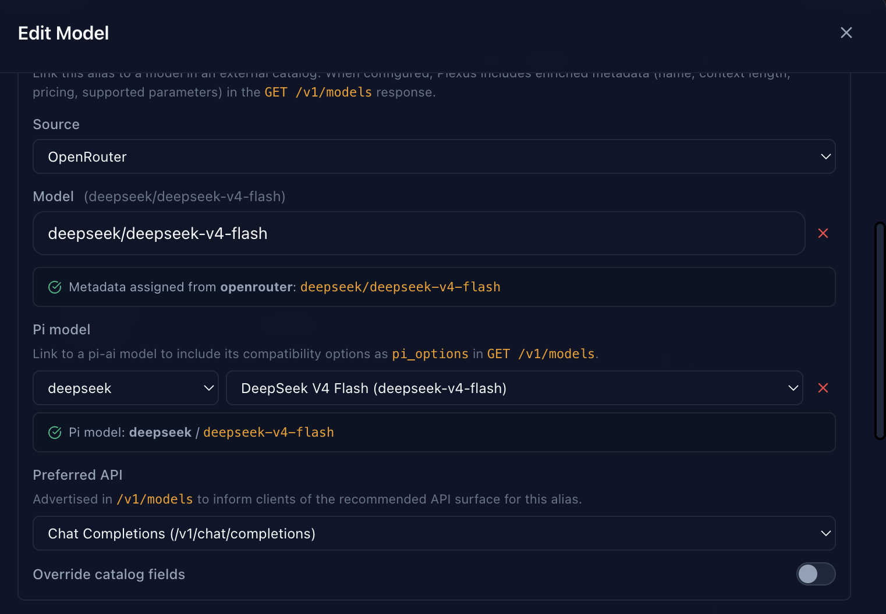

# pi-plexus

A [pi](https://github.com/earendil-works/pi-mono) extension that adds [Plexus](https://github.com/mcowger/plexus) as a provider, dynamically discovering models from your Plexus instance.

## Requirements

- pi `0.74.0` or later
- A running Plexus instance with a valid API key

## Installation

### Via npm (recommended)

```bash
pi install npm:@mcowger/pi-plexus
```

### Via git

```bash
pi install git:github.com/mcowger/pi-plexus
```

## Configuration

Once installed, run the login command inside pi:

```
/plexus login
```

You will be prompted for:
1. **Base URL** — the root URL of your Plexus instance, e.g. `https://plexus.example.com` (no `/v1` suffix needed)
2. **API key** — your Plexus API key

Credentials are stored in `~/.pi/agent/auth.json` (API key, managed by pi) and `~/.pi/agent/extensions/plexus/config.json` (base URL).

### Environment variables

As an alternative to `/plexus login`, you can set environment variables before starting pi:

```bash
export PLEXUS_BASE_URL=https://plexus.example.com
export PLEXUS_API_KEY=sk-...
```

## Commands

| Command | Description |
|---|---|
| `/plexus login` | Configure base URL and API key |
| `/plexus refresh` | Re-fetch the model list from your Plexus instance and update the local cache |

## How it works

On startup, the extension loads a cached model list from `~/.pi/agent/extensions/plexus/plexus-models-cache.json` so models are available immediately. On each session start it attempts a live refresh from `/v1/models` to pick up any new or removed models.

Models are registered under the `plexus` provider and appear in `/model` alongside all other configured providers.

### Provider-specific model fidelity via `pi_provider` / `pi_model`

Many models require provider-specific compatibility settings (e.g. DeepSeek needs `system` role instead of `developer`, Qwen uses a different thinking format, etc.). pi already knows these settings for built-in providers, but when models are proxied through Plexus, pi can't auto-detect them because the provider and base URL belong to Plexus, not the original provider.

To solve this, configure Plexus to expose `pi_provider` and `pi_model` in its `/v1/models` response. When these fields are set, the extension looks up the full model definition from pi's built-in MODELS registry and uses it for maximum fidelity — picking up the correct `api`, `compat`, `thinkingLevelMap`, `reasoning`, `contextWindow`, `maxTokens`, and `input` modalities, all sourced from pi's curated configuration rather than inferred from Plexus fields.

In your Plexus model configuration, enable the **pi Provider** and **pi Model** fields:



For example, a DeepSeek V4 Flash entry configured with `pi_provider: deepseek` and `pi_model: deepseek-v4-flash` will automatically get the correct compat settings (including `supportsDeveloperRole: false` and `thinkingFormat: deepseek`), ensuring requests are formatted correctly for DeepSeek even though they're routed through Plexus.

If `pi_provider` / `pi_model` are not set for a model, the extension falls back to inferring settings from the Plexus API fields (preferred_api, supported_parameters, architecture, etc.) — which works fine for simpler models but won't include provider-specific compat overrides.

## Troubleshooting

The extension writes a debug log to `~/.pi/agent/extensions/plexus/plexus.log`. If models are missing or requests are failing, check that file first:

```bash
cat ~/.pi/agent/extensions/plexus/plexus.log
```
